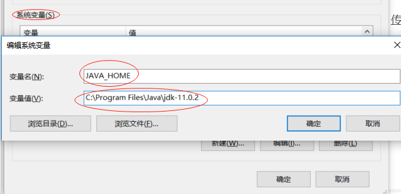

title: windows系统安装并配置JDK
author: 骑马揍比尔
tags:
  - JDK
categories:
  - JDK
date: 2019-01-20 12:51:00
---


## 1.下载安装
下载JDK，根据个人需要下载版本。
[传送门](https://www.oracle.com/technetwork/java/javase/downloads/index.html)https://www.oracle.com/technetwork/java/javase/downloads/index.html

如果下载的exe文件，双击安装，指定好路径。

<!--more-->

## 2.配置环境变量

打开系统环境变量面板


点击新建系统变量




```
变量名：JAVA_HOME
变量值：填写刚才jdk安装路径
```

接下来需要在Path系统变量下引入刚才配置的JAVA_HOME，在系统变量中找到Path后点击编辑按钮将;%JAVA_HOME%\jre\bin追加到后面。 

>PS：注意:win10以下系统最前面的那个英文分号，如果你的Path系统变量最后有这个英文分号那就不需要再加了，如果没有的话一定要加上这个英文分号。

## 3.验证环境变量是否设置成功 

 输入java -version查看版本号
 >java -version


输入javac显示使用信息
>javac


如果以上均可，表示JDK安装配置成功

参考文章：https://blog.csdn.net/moxiaofei1208/article/details/80988626